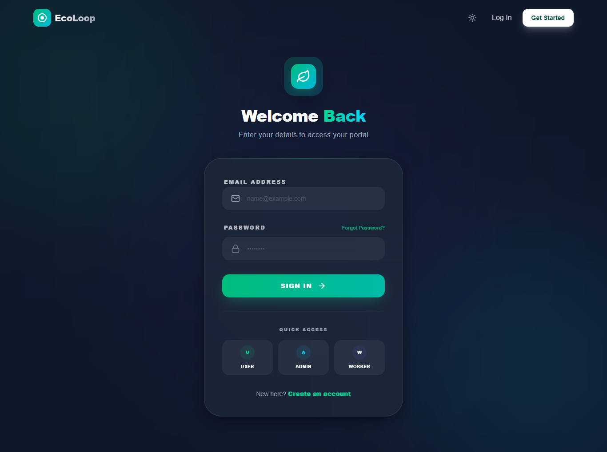
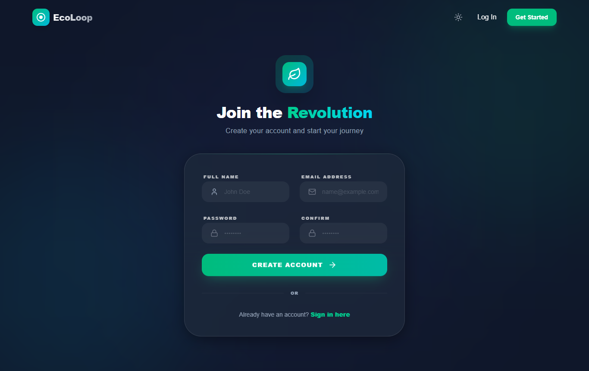
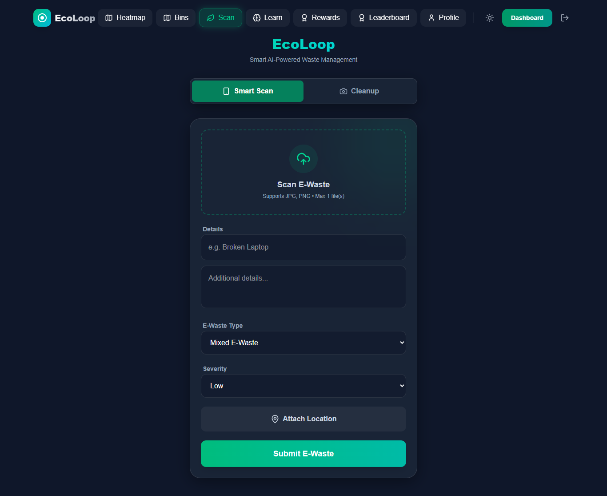
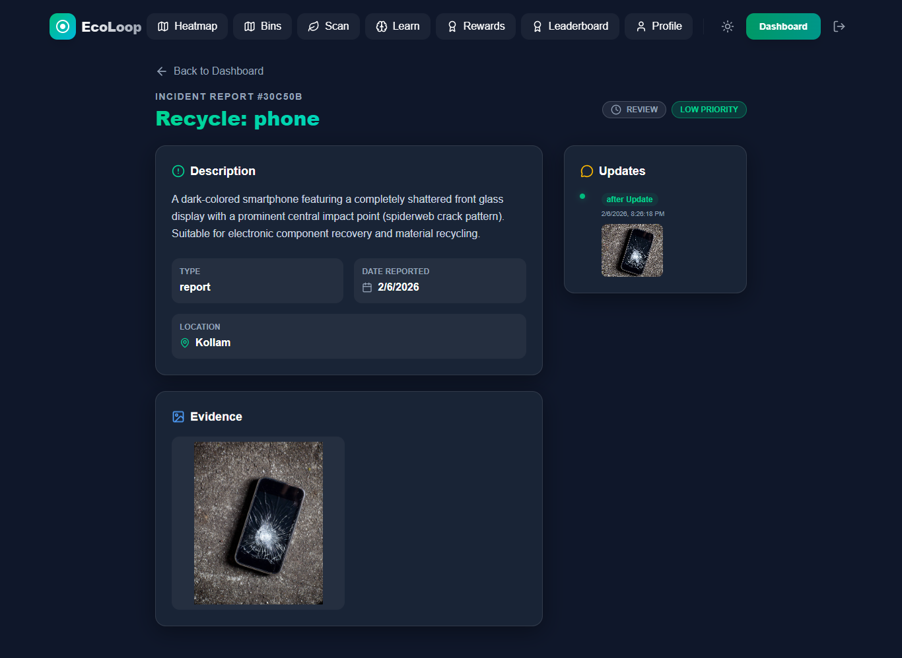
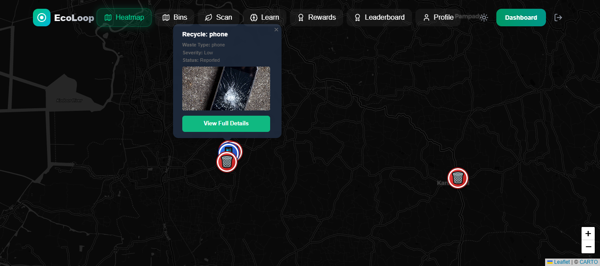
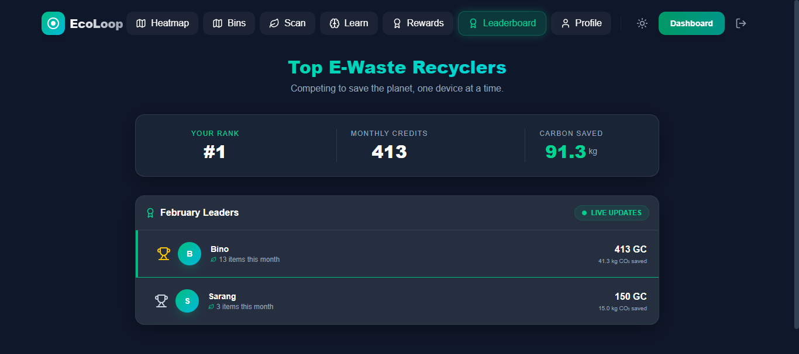
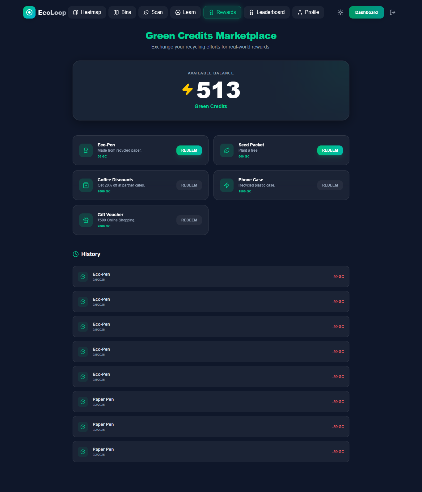
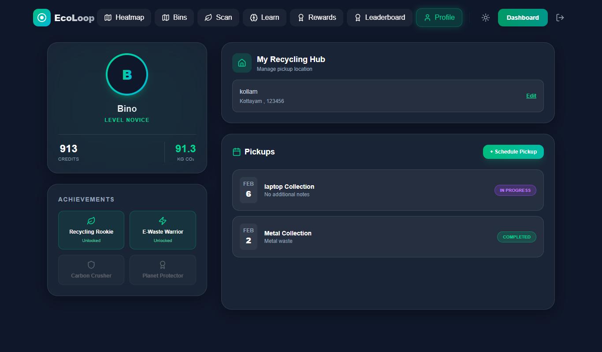
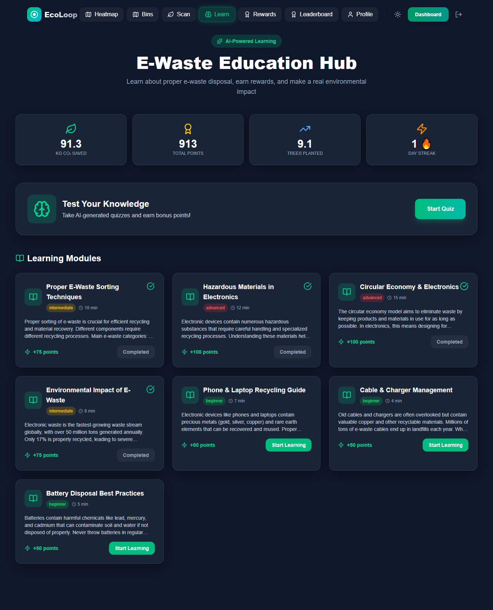
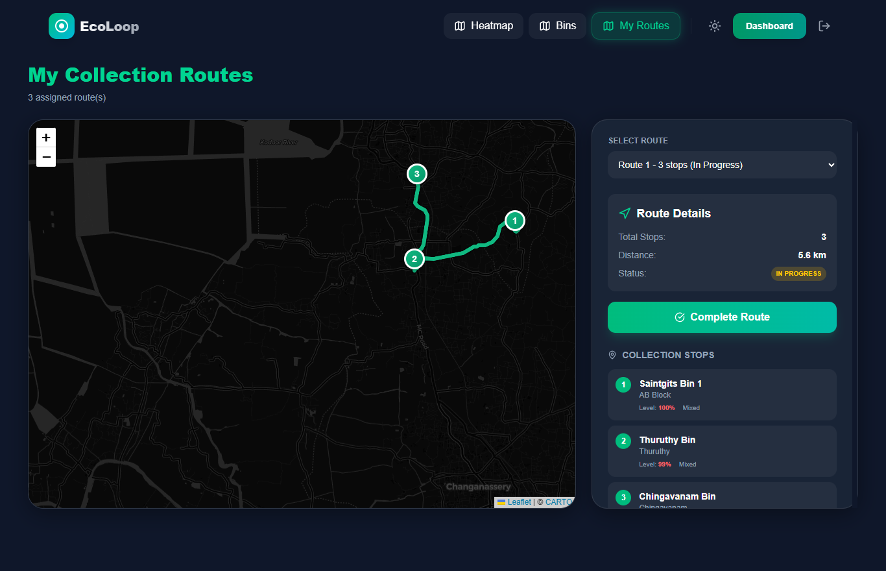

# Smart E-Waste Collection & Disposal Ecosystem 🚀

**Live Website:** https://haxplorebugslayezzz.pages.dev  

**Video Demo:** 

**Github:** https://github.com/binojp/Haxplore-bugslayezzz

**Team Name:** Bugslayezzz  
**Team Leader:** Bino J Panicker

## Table of Contents

- [Why This Project Exists](#why-this-project-exists)
- [Core Roles](#core-roles)
- [User Experience](#user-experience)
- [Admin Dashboard](#admin-dashboard)
- [Worker Interface](#worker-interface)
- [Education & Awareness](#education--awareness)
- [UX Design Principles](#ux-design-principles)
- [Technical Highlights](#technical-highlights)
- [Screenshots](#screenshots)
  - [Login Page](#login-page)
  - [Register Page](#register-page)
  - [User Dashboard](#user-dashboard)
  - [Report E-Waste](#report-e-waste)
  - [User Report Details](#user-report-details)
  - [Heatmap](#heatmap)
  - [Bin Map – Category Selection](#bin-map--category-selection)
  - [Bin Map – Navigation](#bin-map--navigation)
  - [Leaderboard](#leaderboard)
  - [Rewards](#rewards)
  - [Profile](#profile)
  - [Education](#education)
  - [Admin Dashboard](#admin-dashboard-1)
  - [Admin Report Details](#admin-report-details)
  - [Worker Dashboard](#worker-dashboard)
  - [Worker Report Details](#worker-report-details)
  - [Worker Routes](#worker-routes)
  - [Truck Routes](#truck-routes)
- [Scalability & Future](#scalability--future)
- [Final Thought](#final-thought)

## Why This Project Exists 🌍

E-waste grows faster than people can handle responsibly.  
Biggest barriers: confusion, distrust, zero motivation.

People ask:
- Where do I throw this? ❓
- Is it accepted? ✅
- Does it matter? 🌱
- What happens next? 👀

Solution → Clear + Trustworthy + Rewarding experience.

## Core Roles 👥

| Role   | Focus                                      | Main Goal                      |
| ------ | ------------------------------------------ | ------------------------------ |
| User   | Discover bins, report, earn, track impact  | Feel good while recycling      |
| Admin  | Monitor city, assign work, optimize routes | Keep system efficient          |
| Worker | Verify, collect, follow routes             | Finish tasks quickly & clearly |

## User Experience 📱

1. **Dashboard** 🏠  
   Green credits • Impact score • Rank • Leaderboard • Past reports

2. **AI-powered Reporting** 📸  
   Upload photo → AI detects → Select type/severity → Add location → Submit  
   Transparent confidence + rejection handling

3. **Rewards & Gamification** 🏆  
   Points for: reports • pickups • education  
   Redeem gifts • Levels • Achievements • Monthly leaderboard

4. **Smart Bin Finder** 🗺️  
   Pick waste type → See nearest compatible bins → Real-time route + ETA

5. **Home Pickup** 🚚  
   Set home → Schedule → Auto-assign → Track → Extra points

6. **Full Transparency** 🔍  
   Report detail page: user photos + AI result + worker after-photos + status

## Admin Dashboard ⚙️

- Live stats: reports today, pending, resolved, active users 📊
- City-wide e-waste heatmap 🔥
- Assign workers + status updates + proof upload
- Add & manage bins on map 📍
- Create optimized truck routes (less fuel) 🚛

## Worker Interface 🛠️

- My assigned reports & pickups
- Heatmap + bin view
- Verify proof • Update status
- Assigned routes with bin fill level + distance + time
- House pickup list

## Education & Awareness 📚

Topics:
- Battery disposal ⚡
- Phone & laptop recycling 📱💻
- Cables & chargers 🔌
- E-waste environmental impact 🌡️
- Hazardous materials ☣️
- Proper sorting 🗑️
- Circular economy ♻️

Rewards:
- Module complete → +50
- Quiz ≥80% → +100
- Perfect quiz → +150
- Daily streak → +25/day

## UX Design Principles ✨

- ≤ 3 taps to core actions
- Always explain AI decisions
- Calm, visible error handling
- Dark mode 🌙
- Micro-interactions & notifications 🔔
- Works for non-tech & elderly users 👵

## Technical Highlights 🛠️

- Role-based access
- AI detection + confidence
- Real-time maps & routing
- Auto pickup + worker assignment
- Heatmaps
- Gamification engine
- Responsive + offline-aware

## Screenshots 📸

### Login Page
Secure user login form  

### Register Page
New user registration form  

### User Dashboard
Credits • Impact score • Rank • Past reports • Quick actions  

### Report E-Waste
Upload image → AI detection → Type, severity, location  

### User Report Details
Full report: evidence, AI result, status history, after photos  

### Heatmap
City-wide e-waste hotspot visualization  

### Bin Map – Category Selection
Select e-waste type → View compatible bins  

### Bin Map – Navigation
Real-time route, distance, ETA to selected bin  

### Leaderboard
Monthly ranking of top contributors  

### Rewards
Points balance • Redeem gifts • Achievements list  

### Profile
User details • Credits • Level • Home location setup  

### Education
Learning modules • Quizzes • Daily streak tracker  

### Admin Dashboard
Live stats • Recent reports • Quick heatmap access  

### Admin Report Details
Assign worker • Update status • Upload proof photos  

### Worker Dashboard
Assigned reports • Pickups • Task stats  

### Worker Report Details
Verify evidence • Update status • View details  

### Worker Routes
Assigned collections • Bin levels • Distance & time  

### Truck Routes
Optimized truck paths • Fill levels • Fuel-efficient planning  

## Scalability & Future 🚀

Ready for:
- 1000+ bins
- City-wide rollout
- Predictive analytics
- Facility integration
- Community challenges

## Final Thought 💡

This is not just another disposal app.  
It solves behavior + trust + motivation  not only logistics.  
People recycle when it feels **clear**, **trustworthy**, and **rewarding**.  
EcoLoop makes that happen. 🌿